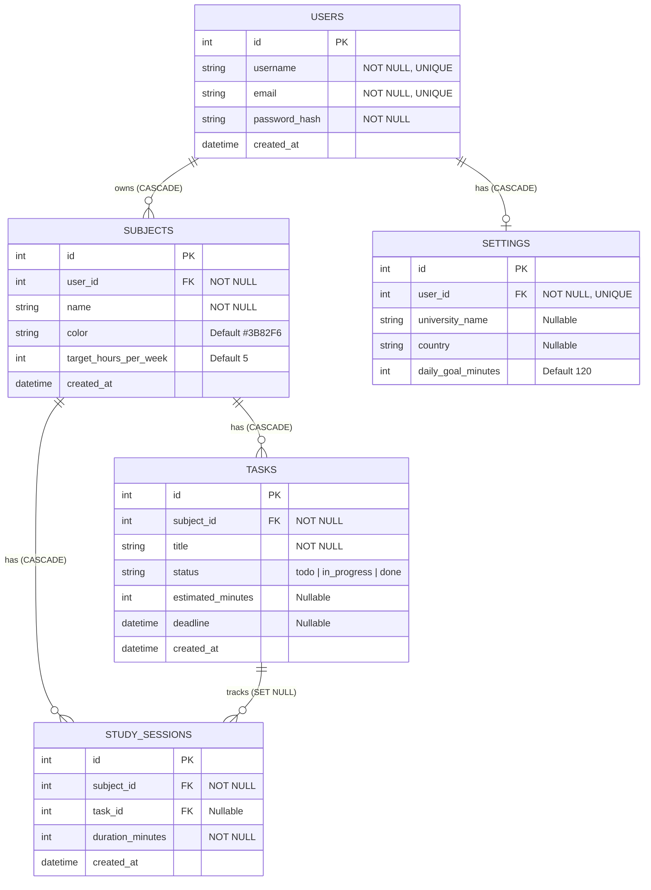

# study-analytics-hub
A web app designed to make your learning easier, track your progress, and improve your concentration

# data base

```mermaid
erDiagram
    USERS ||--o{ SUBJECTS : "owns (CASCADE)"
    USERS ||--o| SETTINGS : "has (CASCADE)"
    SUBJECTS ||--o{ TASKS : "has (CASCADE)"
    SUBJECTS ||--o{ STUDY_SESSIONS : "has (CASCADE)"
    TASKS ||--o{ STUDY_SESSIONS : "tracks (SET NULL)"

    USERS {
        int id PK
        string username "NOT NULL, UNIQUE"
        string email "NOT NULL, UNIQUE"
        string password_hash "NOT NULL"
        datetime created_at
    }

    SETTINGS {
        int id PK
        int user_id FK "NOT NULL, UNIQUE"
        string university_name "Nullable"
        string country "Nullable"
        int daily_goal_minutes "Default 120"
    }

    SUBJECTS {
        int id PK
        int user_id FK "NOT NULL"
        string name "NOT NULL"
        string color "Default #3B82F6"
        int target_hours_per_week "Default 5"
        datetime created_at
    }

    TASKS {
        int id PK
        int subject_id FK "NOT NULL"
        string title "NOT NULL"
        string status "todo | in_progress | done"
        int estimated_minutes "Nullable"
        datetime deadline "Nullable"
        datetime created_at
    }

    STUDY_SESSIONS {
        int id PK
        int subject_id FK "NOT NULL"
        int task_id FK "Nullable"
        int duration_minutes "NOT NULL"
        datetime created_at
    }
```
